# E203-Source-code-analysis
该文档是个人阅读学习蜂鸟E203源码的笔记

---
# 概述
蜂鸟E203处理器是一款开源RISC-V处理器。该项目中提供了完整的架构设计与调试方案，其设计代码使用标准Verilog语法以工业级标准进行开发，十分值得阅读学习。在源代码中具有丰富的注释，但是仍有许多代码设计未有详细解释。该文档记录了个人阅读源码的记录、整理与总结。
# E203处理器概述
### 1. 模块划分
1.1 蜂鸟E203处理器核的总体微架构设计与模块层次划分如下图所示

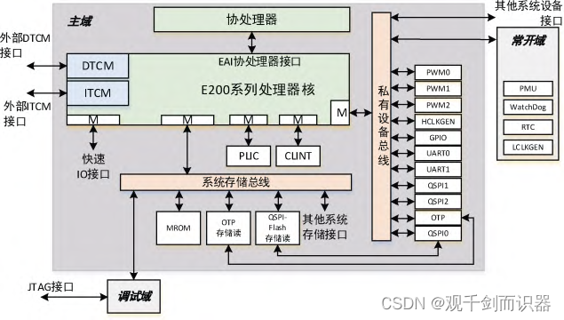

1.2 主要功能模块源码文件的例化关系

### 2. 流水线设计
E203总体上采用了“取值-执行”变长两级流水线设计

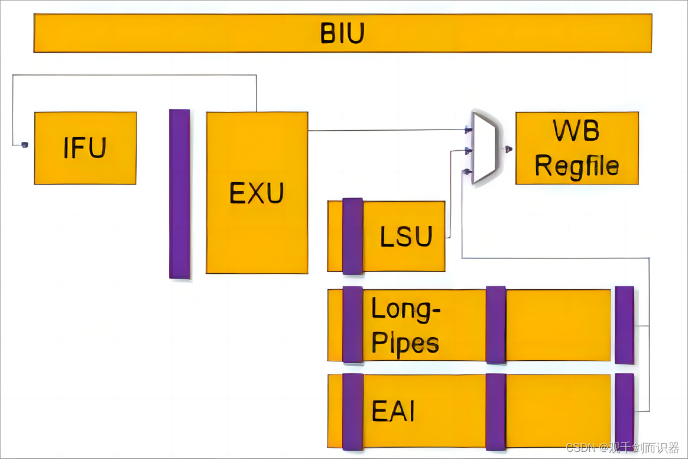

---
## 一、e203_ifu取指模块源码分析
1. e203_ifu模块主要有以下功能
    - 根据PC从存储器中取出指令
    - 根据取值与执行情况设置IF与EX之间流水线寄存器的值
    - 完成简单的分支预测，并将预测结果传递给PC生成单元
2. 微架构

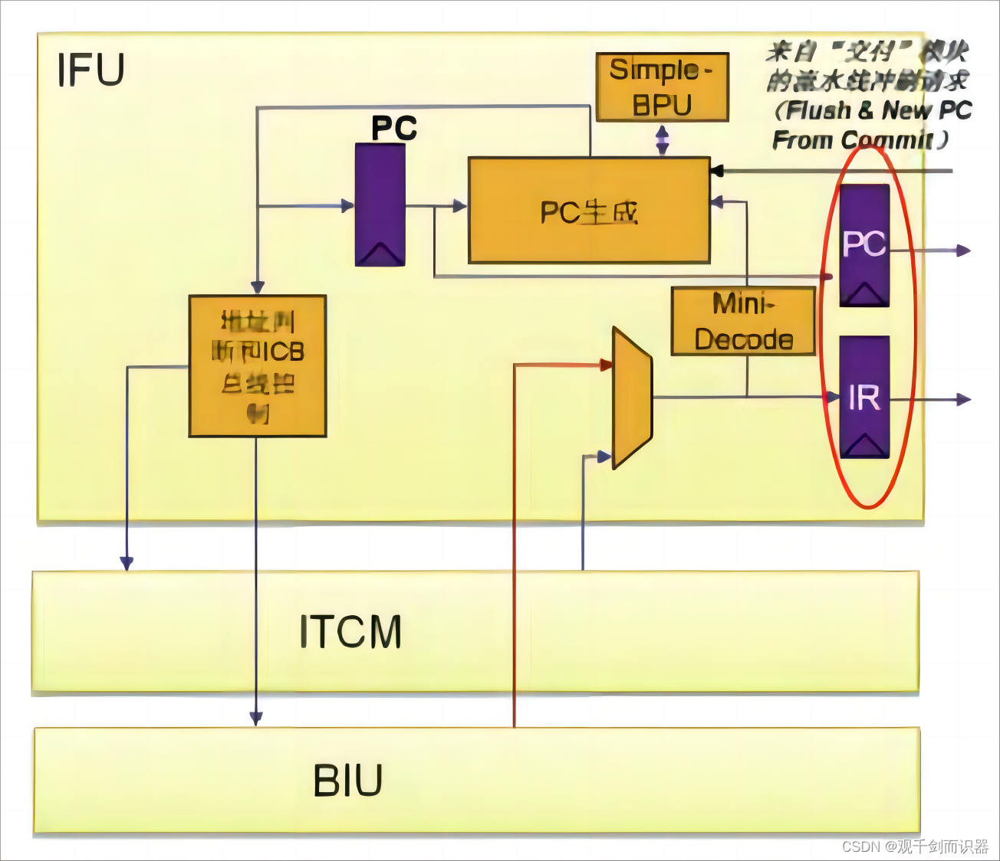

3. 源文件例化关系

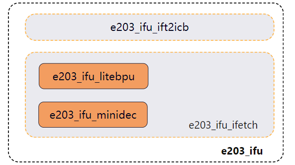

---
### 1.1 微型译码器：minidec.v
1. 功能：对取回的指令进行简单译码，给出相关信息
2. 实现：minidec例化了exu阶段的译码器。由于只用到了部分功能，将不需要的输入输出端口悬空(完整的decode模块在后面)
##### minidec保留的输入输出端口
1. 输入
    - instr: 指令字段
2. 输出
    - **寄存器访问信息**
    - dec_rs1en: 寄存器读端口1使能
    - dec_rs2en: 寄存器读端口2使能
    - dec_rs1idx: 读端口1目标寄存器
    - dec_rs2idx: 读端口2目标寄存器
    - 
    - **乘除法信息**
    - dec_mulhsu: 
    - dec_mul:
    - dec_div: 
    - dec_rem: 
    - dec_divu: 
    - dec_remu: 
    - 
    - **指令信息：用于分支预测**
    - dec_rv32: 是否为32位指令
    - dec_bjp: 是否为跳转指令
    - dec_jal: 是否为jal指令
    - dec_jalr: 是否为jalr指令
    - dec_bxx: 是否为bxx指令
    - dec_jalr_rs1idx: jalr指令要读取的寄存器号
    - dec_bjp_imm: 跳转指令中的立即数字段
### 1.2 完整的译码单元：e203_exu_decode.v
1. 译码的依据：RISC-V的指令编码
2. 译码输出信息
    - 指令长度
    - 指令类别
    - 指令功能（识别出特定指令）
    - 指令相关信息（可能在执行时用到）
3. 译码单元代码根据功能主要分为两部分
    - 指令字段分析：提取并判断指令字段的各部分
    - 译码输出信号形成：根据字段分析结果给出相关信号
##### 1.2.1 指令字段分析
RISC-V的指令编码有较强的规律性，**指令字段**中特定位置的编码所表示的信息较为固定，这也使得译码单元在对不同指令进行译码时均可以复用这些字段的编码信息。因此译码阶段先对输入指令的字段进行分析判断，得到**字段编码信息**，然后利用这些编码信息组合成**译码结果**。流程如下

##### 1.2.2 译码信息形成
利用字段分析的结果，根据指令的需求组合形成译码阶段输出的结果信号
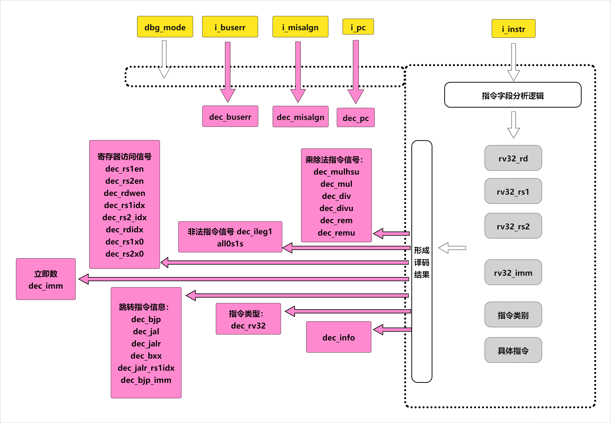
##### 1.2.3 关于译码输出：dec_info
译码结果要指出当前进行译码的是ISA中的哪一条指令，这一输出信息为dec_info。为了充分利用dec_info这一输出端口，不同类别的指令可以复用这一输出信号，根据信号中特定字段来判断当前的dec_info所表示的是哪一类指令。基本设计如下
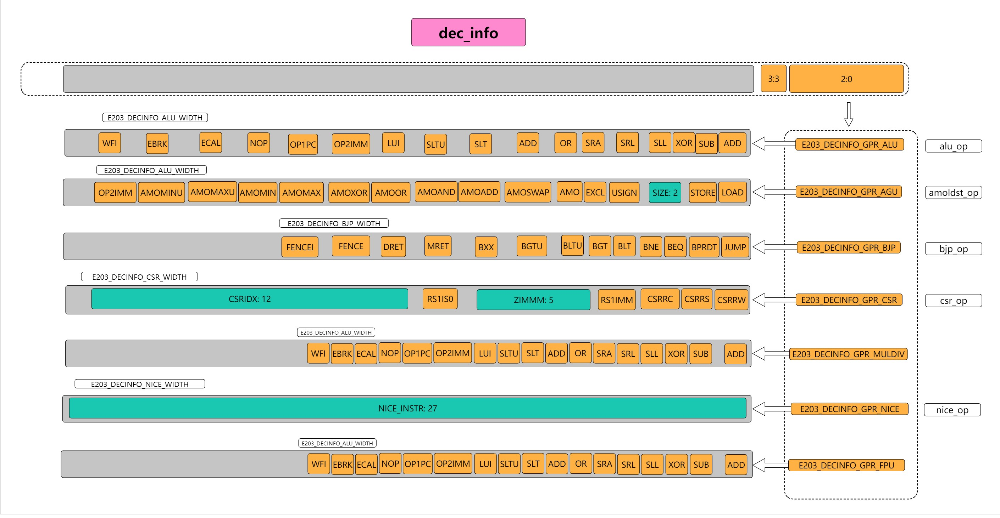
- dec_info字段有七种格式，对应不同类别的指令，通过dec_info最低三位进行区分
- 第四位指明当前指令是否为32位指令
- 同一类指令通过dec_info内部的编码进行区分
### 1.3 分支预测单元：e203_ifu_litebpu.v
E203的分支预测单元在每个周期根据当前的PC值与指令的简单译码结果，给出下一次取值的PC，将其作为PC的输入，总体微架构设计如下

1. 方向预测
   - 对于无条件跳转指令，均预测为跳转：jal, jalr
   - 条件分支指令bxx，采取BTFN，向后预测为跳转，向前不跳转
2. 跳转地址计算
   - jal，bxx：跳转地址通过PC与指令中立即数字段相加得到
   - jalr：需要访问寄存器，分为以下三种情况
     - 访问r0：值默认为0，不需要真正访问寄存器
     - 访问r1：有为r1专门设计的硬件电路，不需要占用寄存器堆的端口
     - 访问其他寄存器：通过寄存器堆的读端口读取数据
3. 数据依赖问题
对于jalr指令，当所访问的寄存器存在**RAW数据依赖**或所需的**寄存器值读取尚未就绪**时，BPU单元会发出bpu_wait请求信号，直到相关操作数准备好
4. BPU输入输出接口

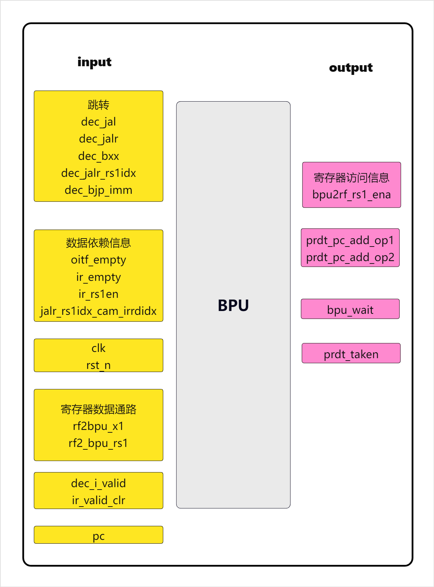

5. 寄存器堆访问
- 访问r0：直接设置为0即可
- 访问r1：当jalr中的指令需要使用r1的值时，利用设计好的电路可以在一个周期内返回r1的值，前提是不存在数据依赖。相应的端口为rf2bpu_x1
- 访问rn：当jalr指令中引用的寄存器不是r0或r1时，需要等到RAW依赖解除、并且端口空闲之后，访问寄存器堆读端口来获取所需的数据，获取数据的端口为rf2bpu_rs1。具体设计如下

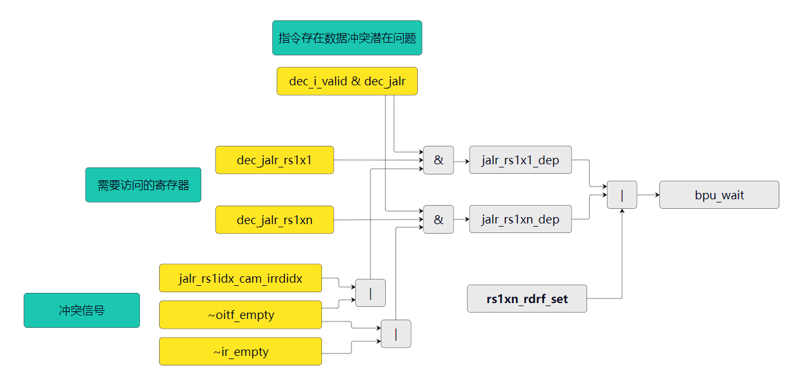

- **jalr_rs1x1_dep**：访问r1存在潜在的冲突（数据冲突或资源冲突）
- **jalr_rs1xn_dep**：访问rn存在潜在的冲突
- **bpu_wait**: 表示BPU单元发出等待请求，原因为：用于分支预测的寄存器值尚未就绪。导致寄存器值未就绪的原因包括
  - RAW数据依赖关系尚未解决：jalr_rs1x1_dep，jalr_rs1xn_dep
    - IR或oitf模块中存在指令可能需要访问同一个寄存器端口（资源冲突）
    - IR或oitf模块中存在指令可能需要写回该寄存器（数据冲突）
  - 正在读取寄存器中，数据返回值尚未就绪：rs1xn_rdrf_set
- **rs1xn_rdrf_set**: 寄存器读取请求（只针对除r0, r1之外的寄存器读取，因为r1读取有专门的数据通路），发出该请求的条件如下
  - 指令为jalr并且该指令需要访问除r0, r1以外的寄存器（形成rs1xn_rdrf_set信号的第2、3、4个条件）
  - 如果不存在潜在的数据依赖问题（即IR中没有指令且没有长指令），设置寄存器访问信号
  - 如果潜在的依赖只存在于IR中，没有长指令，而且IR中的指令不需要访问第一个寄存器端口（不存在资源冲突），此时可以直接读取寄存器（由于IR中的指令可能后续会写回寄存器，存在RAW数据冲突问题，可能需要在后续设计中解决这一问题）

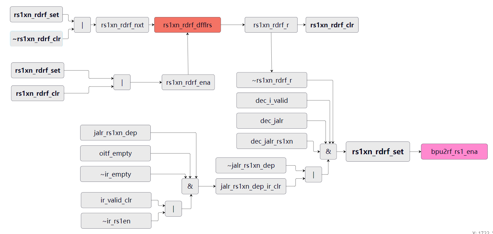

- **rs1xn_rdrf_clr & rs1xn_rdrf_set**
此处有一个设计，通过clr与set信号相配合使得寄存器访问信号set在开启一个周期之后会自动关闭，直到发出下一次寄存器堆端口访问请求。一个典型的执行流程中clr与set的变化如下

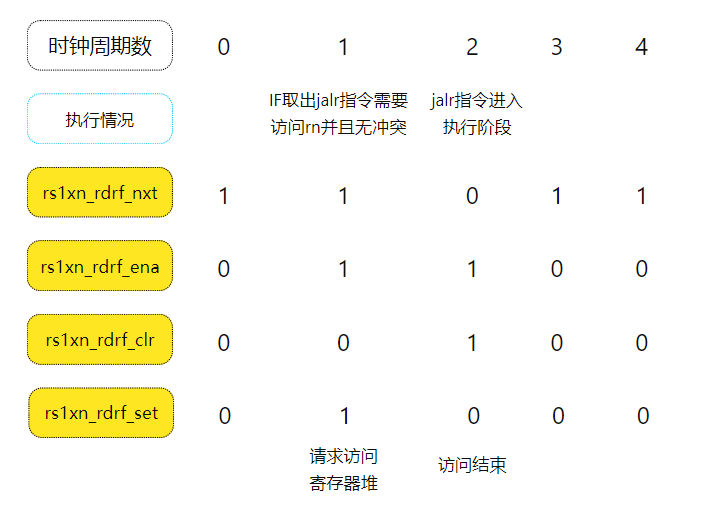

6. 分支预测地址计算
分支预测地址通过两个操作数相加得出，根据指令的不同对操作数进行相应的设置
- bxx/jal：
  - prdt_pc_add_op1：跳转指令的pc
  - prdt_pc_add_op2：跳转指令中的立即数bjp_imm
- jalr r0
  - prdt_pc_add_op1：0
  - prdt_pc_add_op2：bjp_imm
- jalr r1
  - prdt_pc_add_op1：为r1专门设置的数据通路：rf2bpu_x1，从中得到r1值
  - prdt_pc_add_op2：bjp_imm
- jalr rn
  - prdt_pc_add_op1：寄存器堆访问结果：rf2bpu_rs1
  - prdt_pc_add_op2：bjp_imm
### 1.4 各功能部件整合：e203_ifu_ifetch.v
e203的取指单元主要分为两部分，e203_ifu_ifetch实现了PC，IR寄存器，并将其和之前叙述的minidec与litebpu结合起来，组成了取指控制电路；而另一部分即e203_ifu_ift2icb则专门负责管理对指令存储器的访问。下图描述了e203_ifu_ifetch相关的模块例化关系。

e203_ifu_ifetch.v模块的输入输出接口主要根据大体功能可以分为以下几类
- 向指令存储器发送的信号（output）
  - ifu_req_pc：
  - ifu_req_last_pc：
  - ifu_req_seq：
  - ifu_req_seq_rv32：
  - ifu_req_valid
  - ifu_rsp_ready
- 指令存储器访问结果以及指令存储器的状态（input）
  - ifu_rsp_instr
  - ifu_rsp_err
  - ifu_rsp_valid
  - ifu_req_ready
- ifu单元的输出（用于ex阶段或者进行相关控制）（output）
  - ifu_o_ir
  - ifu_o_buserr
  - ifu_o_valid
  - ifu_o_pc
  - ifu_o_pc_vld
  - ifu_o_rs1idx
  - ifu_o_rs2idx
  - ifu_o_prdt_taken
  - ifu_o_misalgn
  - ifu_o_muldiv_b2b
  - ifu_o_valid
  - inspect_pc
- 执行单元传回的信号（input）
  - ifu_o_ready
  - oitf_empty
  - rf2ifu_x1
  - rf2ifu_rs1
  - dec2ifu_rs1en
  - dec2ifu_rden
  - dec2ifu_rdidx
  - dec2ifu_mulhsu
  - dec2ifu_div
  - dec2ifu_rem
  - dec2ifu_divu
  - dec2ifu_remu
- 用于冲刷流水线的相关信号
  - pipe_flush_req
  - pipe_flush_pc
  - pipe_flush_add_op1
  - pipe_flush_add_op2
- halt信号
  - ifu_halt_req
  - ifu_halt_ack
- 时钟与复位
  - clk
  - rst_n
- 其他信号
  - pc_rtvec
  - pipe_flush_ack
##### 1.4.1 总体微架构设计
ifetch部分的总体微架构设计如图所示

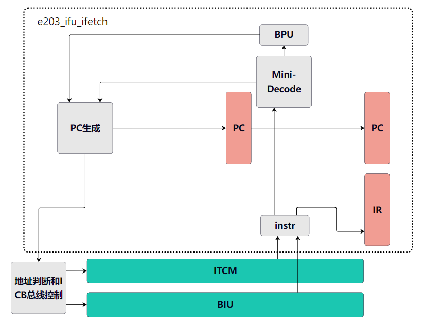

##### 1.4.2 取指
1. **提前取指**
在取指阶段，一般是根据PC中的值，访问指令存储器得到指令。而在E203中，实际上对指令存储器的访问在PC设置为新值之前就已经开始了。基本的设计如下  
新的PC值由PC生成电路生成，在PC寄存器pc_dfflr被设置为该值之前，这个新的PC值已经被用于访问指令存储器，并将访存结果存储在指令寄存器访问单元的一个特殊的时序逻辑电路中（根据注释，这一时序逻辑有特殊的功能，目前可以简单看做寄存器）；当新的PC值被设定时，这一提前提取出的指令就被设置为指令存储器控制模块的输出，此时的效果就是：从控制模块返回的指令信号恰好就是当前PC所指示的指令。

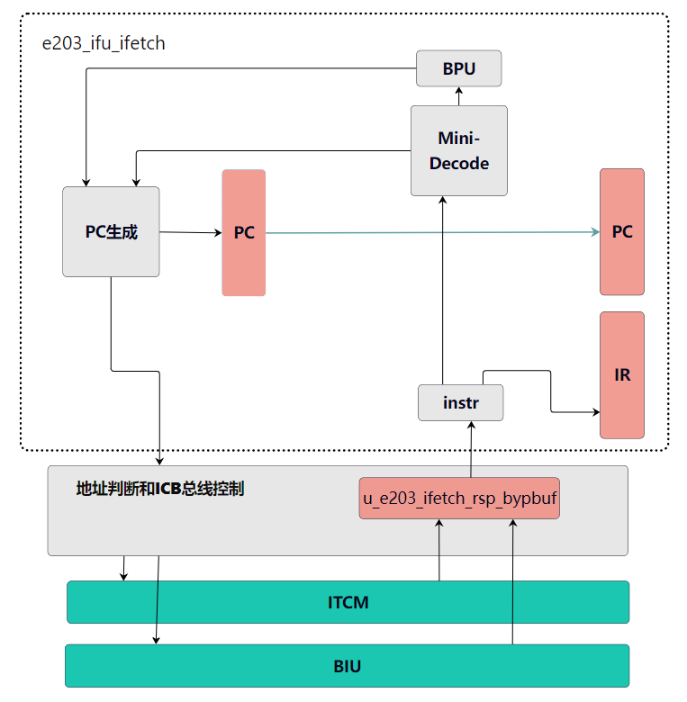

2. **取指输出接口**
以下列出e203_ifu_ifetch模块的输出信号，这些信号来源于当前的PC值、微型译码器的译码结果、以及BPU的预测结果，用于访问指令存储器
- ifu_req_pc：取指令所用的PC值
- ifu_req_last_pc：上一次进行取值的PC值（即当前PC中的值）
- ifu_req_seq：根据当前PC中的值，按顺序取下一条指令（无跳转，无流水线冲刷，无reset）
- ifu_req_seq_rv32：表示当前指令为32位，如果此次取指为顺序取指，该信号给出用于下次取指的PC的自增量
- ifu_req_valid：ifetch发出了有效的取指令请求
- ifu_rsp_ready：IR准备好接受下一条指令
3. **取指令输入接口**
取指返回结果，以及一些状态信息
- ifu_req_ready：访存部件准备好接受下一次访存请求
- ifu_rsp_valid：访存部件返回的指令有效
- ifu_rsp_err：访存发生错误
- ifu_rsp_instr：返回的指令
##### 1.4.3 解码与分支预测
1. 在e203_ifu_ifetch模块中，例化了一个decode模块和一个BPU模块，其中decode模块根据需求只例化了一部分，将不需要的端口悬空。
2. 从指令存储器访问控制模块中输出的指令，经过上述简单decode模块解码，给出指令的基本信息，这些信息进一步用做BPU的输入，作为其预测下一个PC值的依据
3. 译码器与BPU均为逻辑电路
##### 1.4.4 IF/EX流水线寄存器输出
在IF阶段给出的信号，如果要在EX阶段使用，需要将其设置到IF/EX之间的流水线寄存器中。流水线寄存器在e203_ifu_ifetch中实现，其内容通过模块的输出端口输出到EX模块中。主要输出端口如下
- ifu_o_ir：IR，为当前传入EX的指令
- ifu_o_buserr：说明取指时访问指令存储器时发生了错误
- ifu_o_valid：IR中的指令是否有效
- ifu_o_rs1idx：寄存器堆端口1的目标寄存器
- ifu_o_rs2idx：寄存器堆端口2的目标寄存器
- ifu_o_prdt_taken：分支预测是否为taken（bxx指令）
- ifu_o_muldiv_b2b：是否为乘除指令
- ifu_o_misalgn：默认为1'b0（在RV32C中不会发生）
- ifu_o_pc：指令的PC值
- ifu_o_pc_vld：指令的PC值是否有效
##### 1.4.5 握手机制（此处暂不考虑流水线冲刷问题）
时序控制是处理器设计中一个十分重要的部分，关系到设计能否按照需求运行而不会出现时序错误。要理清E203的时序设计，需要将注意力集中在各个时序部件上，也就是寄存器，分析其数据传送关系以及寄存器值更新的条件。   
为了保证数据的安全性，E203采用模块间的握手通信。
1. E203中的时序电路
E203中的时序电路主要包含以下几个部分：1）存储指令地址的PC. 2）存储指令的u_e203_ifetch_rsp_bypbuf. 3）IF与EX之间的流水线寄存器，主要为PC、IR，也包含其他指令信息字段

2. 将E203中主要时序部件提取出来，按照关系整理为下图

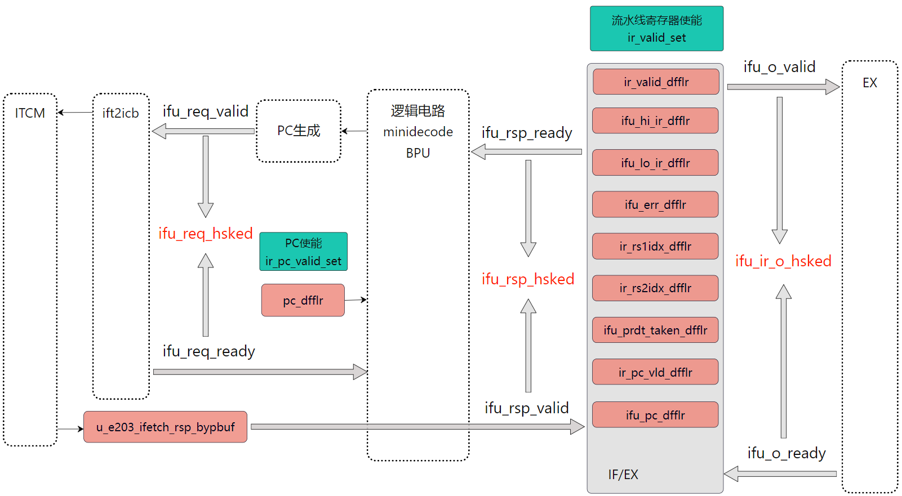

从图中可见，总共有两组流水线寄存器，分别是PC和IF/EX；与之对应，有三组握手信号，分别对应：取指，设置IR，指令执行。   
相应控制信号关系如下
- 执行阶段握手信号：**ifu_ir_o_hsked** = (ifu_o_valid & ifu_o_ready). 当该信号被拉高时，表明IR中的指令有效并且已经执行完成，准备好接受下一条指令
- 流水线寄存器使能信号：**ir_valid_set** = ifu_rsp_hsked （PC与IF/EX握手成功才设置流水线寄存器）
- IF/EX准备好接受新指令的条件判断：**ifu_rsp_ready** = ifu_rsp2ir_ready = ifu_ir_i_ready & ifu_req_ready 其中
    - **ifu_ir_i_ready**   = (~ir_valid_r) | ir_valid_clr 其中
      - ir_valid_r 为流水线寄存器 ir_valid_dfflr 的输出，表示当前指令是否有效
      - ir_valid_clr = ifu_ir_o_hsked 也就是说指令执行有效但是已经执行完成
      也就是说，当IR中是**无效指令**或者已经**执行完成**时，IR才准备好接受下一条指令
    - ifu_req_ready：
- PC使能信号：**ir_pc_vld_set** = pc_newpend_r & ifu_ir_i_ready
  - pc_newpend_r
  - ifu_ir_i_ready