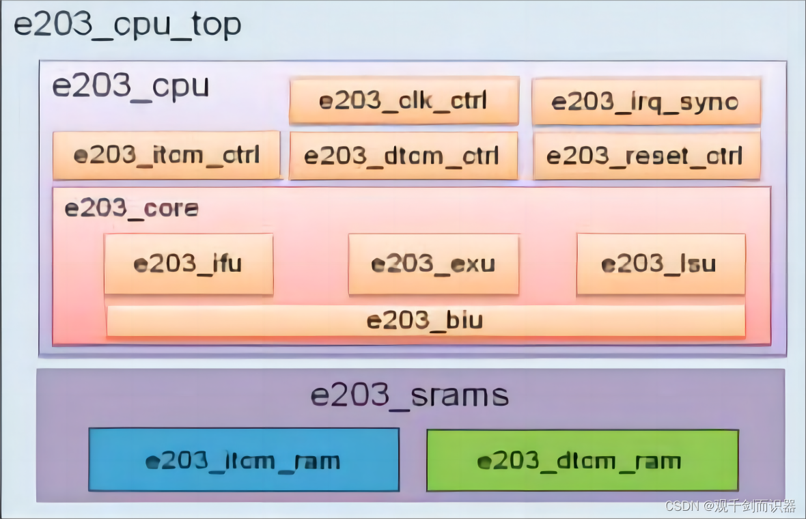
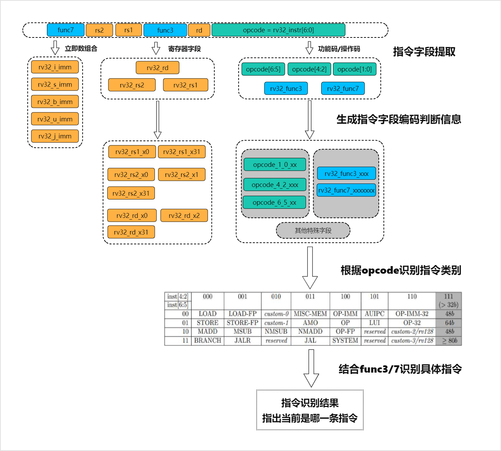
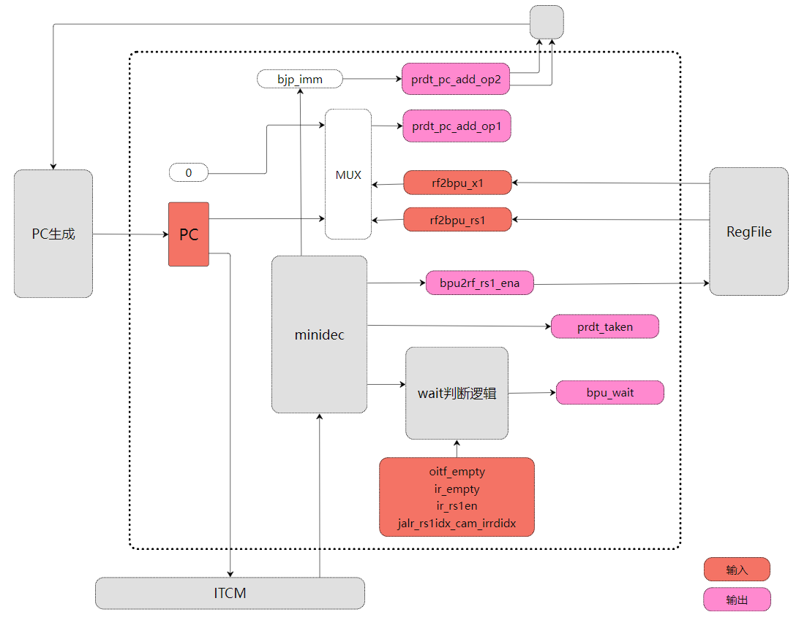

# E203-Source-code-analysis
该文档是个人阅读学习蜂鸟E203源码的笔记

---
# 概述
蜂鸟E203处理器是一款开源RISC-V处理器。该项目中提供了完整的架构设计与调试方案，其设计代码使用标准Verilog语法以工业级标准进行开发，十分值得阅读学习。在源代码中具有丰富的注释，但是仍有许多代码设计未有详细解释。该文档记录了个人阅读源码的记录、整理与总结。
# E203处理器概述
### 1. 模块划分
1.1 蜂鸟E203处理器核的总体微架构设计与模块层次划分如下图所示

1.2 主要功能模块源码文件的例化关系

### 2. 流水线设计
E203总体上采用了“取值-执行”变长两级流水线设计

---
## 一、e203_ifu取指模块源码分析
1. e203_ifu模块主要有以下功能
    - 根据PC从存储器中取出指令
    - 根据取值与执行情况设置IF与EX之间流水线寄存器的值
    - 完成简单的分支预测
    - 更新PC的值
2. 微架构

3. 源文件例化关系

---
### 1.1 微型译码器：minidec.v
1. 功能：对取回的指令进行简单译码，给出相关信息
2. 实现：minidec例化了exu阶段的译码器。由于只用到了部分功能，将不需要的输入输出端口悬空(完整的decode模块在后面)
##### minidec保留的输入输出端口
1. 输入
    - instr: 指令字段
2. 输出
    - **寄存器访问信息**
    - dec_rs1en: 寄存器读端口1使能
    - dec_rs2en: 寄存器读端口2使能
    - dec_rs1idx: 读端口1目标寄存器
    - dec_rs2idx: 读端口2目标寄存器
    - 
    - **乘除法信息**
    - dec_mulhsu: 
    - dec_mul:
    - dec_div: 
    - dec_rem: 
    - dec_divu: 
    - dec_remu: 
    - 
    - **指令信息：用于分支预测**
    - dec_rv32: 是否为32位指令
    - dec_bjp: 是否为跳转指令
    - dec_jal: 是否为jal指令
    - dec_jalr: 是否为jalr指令
    - dec_bxx: 是否为bxx指令
    - dec_jalr_rs1idx: jalr指令要读取的寄存器号
    - dec_bjp_imm: 跳转指令中的立即数字段
### 1.2 完整的译码单元：e203_exu_decode.v
1. 译码的依据：RISC-V的指令编码
2. 译码输出信息
    - 指令长度
    - 指令类别
    - 指令功能（识别出特定指令）
    - 指令相关信息（可能在执行时用到）
3. 译码单元代码根据功能主要分为两部分
    - 指令字段分析
    - 译码输出信号形成
##### 1.2.1 指令字段分析
RISC-V的指令编码有较强的规律性，**指令字段**中特定位置的编码所表示的信息较为固定，这也使得译码单元在对不同指令进行译码时均可以复用这些字段的编码信息。因此译码阶段先对输入指令的字段进行分析判断，得到**字段编码信息**，然后利用这些编码信息组合成**译码结果**。流程如下

##### 1.2.2 译码信息形成
利用字段分析的结果，根据指令的需求组合形成译码阶段输出的结果信号

##### 1.2.3 关于译码输出：dec_info
译码结果要指出当前进行译码的是ISA中的哪一条指令，这一输出信息为dec_info。为了充分利用dec_info这一输出端口，不同类别的指令可以复用这一输出信号，根据信号中特定字段来判断当前的dec_info所表示的是哪一类指令。基本设计如下

- dec_info字段有七种格式，对应不同类别的指令，通过dec_info最低三位进行区分
- 第四位指明当前指令是否为32位指令
- 同一类指令通过dec_info内部的编码进行区分
### 1.3 分支预测单元：e203_ifu_litebpu.v
E203的分支预测单元在每个周期根据当前的PC值与指令的简单译码结果，给出下一次取值的PC，将其作为PC的输入，总体微架构设计如下

1. 方向预测
   - 对于无条件跳转指令，均预测为跳转：jal, jalr
   - 条件分支指令bxx，采取BTFN，向后预测为跳转，向前不跳转
2. 跳转地址计算
   - jal，bxx：跳转地址通过PC与指令中立即数字段相加得到
   - jalr：需要访问寄存器，分为以下三种情况
     - 访问r0：值默认为0，不需要真正访问寄存器
     - 访问r1：有为r1专门设计的硬件电路，不需要占用寄存器堆的端口
     - 访问其他寄存器：通过寄存器堆的读端口读取数据
3. 数据依赖问题
对于jalr指令，当所访问的寄存器存在**RAW数据依赖**或所需的**寄存器值读取尚未就绪**时，BPU单元会发出bpu_wait请求信号，直到相关操作数准备好
4. BPU输入输出接口

5. 寄存器堆访问
- 访问r0：直接设置为0即可
- 访问r1：当jalr中的指令需要使用r1的值时，利用设计好的电路可以在一个周期内返回r1的值，前提是不存在数据依赖。相应的端口为rf2bpu_x1
- 访问rn：当jalr指令中引用的寄存器不是r0或r1时，需要等到RAW依赖解除、并且端口空闲之后，访问寄存器堆读端口来获取所需的数据，获取数据的端口为rf2bpu_rs1。具体设计如下

- **jalr_rs1x1_dep**：访问r1存在潜在的冲突（数据冲突或资源冲突）
- **jalr_rs1xn_dep**：访问rn存在潜在的冲突
- **bpu_wait**: 表示BPU单元发出等待请求，原因为：用于分支预测的寄存器值尚未就绪。导致寄存器值未就绪的原因包括
  - RAW数据依赖关系尚未解决：jalr_rs1x1_dep，jalr_rs1xn_dep
    - IR或oitf模块中存在指令可能需要访问同一个寄存器端口（资源冲突）
    - IR或oitf模块中存在指令可能需要写回该寄存器（数据冲突）
  - 正在读取寄存器中，数据返回值尚未就绪：rs1xn_rdrf_set
- **rs1xn_rdrf_set**: 寄存器读取请求（只针对除r0, r1之外的寄存器读取，因为r1读取有专门的数据通路），发出该请求的条件如下
  - 指令为jalr并且该指令需要访问除r0, r1以外的寄存器（形成rs1xn_rdrf_set信号的第2、3、4个条件）
  - 如果不存在潜在的数据依赖问题（即IR中没有指令且没有长指令），设置寄存器访问信号
  - 如果潜在的依赖只存在于IR中，没有长指令，而且IR中的指令不需要访问第一个寄存器端口（不存在资源冲突），此时可以直接读取寄存器（由于IR中的指令可能后续会写回寄存器，存在RAW数据冲突问题，可能需要在后续设计中解决这一问题）

- **rs1xn_rdrf_clr & rs1xn_rdrf_set**
此处有一个设计，通过clr与set信号相配合使得寄存器访问信号set在开启一个周期之后会自动关闭，直到发出下一次寄存器堆端口访问请求。一个典型的执行流程中clr与set的变化如下

6. 分支预测地址计算
分支预测地址通过两个操作数相加得出，根据指令的不同对操作数进行相应的设置
- bxx/jal：
  - prdt_pc_add_op1：跳转指令的pc
  - prdt_pc_add_op2：跳转指令中的立即数bjp_imm
- jalr r0
  - prdt_pc_add_op1：0
  - prdt_pc_add_op2：bjp_imm
- jalr r1
  - prdt_pc_add_op1：为r1专门设置的数据通路：rf2bpu_x1，从中得到r1值
  - prdt_pc_add_op2：bjp_imm
- jalr rn
  - prdt_pc_add_op1：寄存器堆访问结果：rf2bpu_rs1
  - prdt_pc_add_op2：bjp_imm
